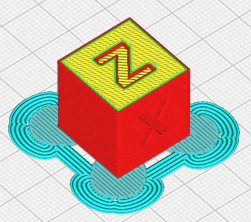

# Tab Anti Warping +
Add element as rounded Tab to limit warping effect in print corner. This plugin is an improved version of my first plugin : [TabAntiWarping](https://github.com/5axes/TabAntiWarping).

Using Helper Disks, which act on the corners of your model to help keep everything pinned down. Once the print is finished, the disks can be cut away pretty easily.

**Note : Actual solution is limited by the possibility to use just a global : Support X/Y Distance**

The automatic functions of adding and deleting tabs make it easy to create each elements.

## Installation

#### Marketplace (recommended):
This plugin is now avalaible in the Cura marketplace. So you can install it automaticaly from this place:

[TabPlus on Ultimaker Market place](https://marketplace.ultimaker.com/app/cura/plugins/5axes/TabPlus)

#### Manually:
First, make sure your Cura version is  4.4 or newer.

Download or clone the repository into `[Cura configuration folder]/plugins/TabPlus`.

The configuration folder can be found via **Help** -> **Show Configuration Folder** inside Cura.

This menu opens the following folder:
* Windows: `%APPDATA%\cura\<Cura version>\`, (usually `C:\Users\<your username>\AppData\Roaming\cura\<Cura version>\`)
* Mac OS: `$HOME/Library/Application Support/cura/<Cura version>/`
* Linux: `$HOME/.local/share/cura/<Cura version>/`

## How to use

- Load a model in Cura and select it
- Click on the "Tab Anti Warping" button on the left toolbar  (Shortcut J)
- Change de value for the tab *Size* in numeric input field in the tool panel if necessary

- Click anywhere on the model to place "Tab Anti Warping" there

- **Clicking existing Tab deletes it**

- **Clicking existing Tab + Ctrl** switch automaticaly to the Translate Tool to modify the position of the "Tab Anti Warping".

* The height of the tabs is automaticaly set to the Initial Layer Height .

- Change de value for the tab *X/Y Distance* in numeric input field in the tool panel if necessary this value will adjust the distance between the tab treated as support and the model . By keeping enought distance, the tab will be easier to remove. 

>Note: it's easier to add/remove tabs when you are in "Solid View" mode

## Define as Capsule

Option "Define as Capsule" to create a Capsule style tab. 

This new design has been integrated following the request of [Reality4DEvolution](https://github.com/Reality4DEvolution) in this post : [Discussion #9](https://github.com/5axes/TabAntiWarping/discussions/9) 

The new design should offer a bevel on the outsite of the tab to be much more easy to remove, as you can get the scraper under it, and start to remove the project much easier.

## Number of layers

Option "Number of layers" to create tabs with several layers height. 

**If the number of layers is bigger than 1, then the **Support Density** is automaticaly set to 100%.**

## Automatic Addition

Add automaticaly the tab on the point of the Convex hull representation of the part.

The option "Set On Adhesion Area" offer to adds the tabs on the Adhesion Area border.

## Remove All / Last

Button to remove the lasts tab created ( **!but also every element defined as support type** )

#### YouTube video

